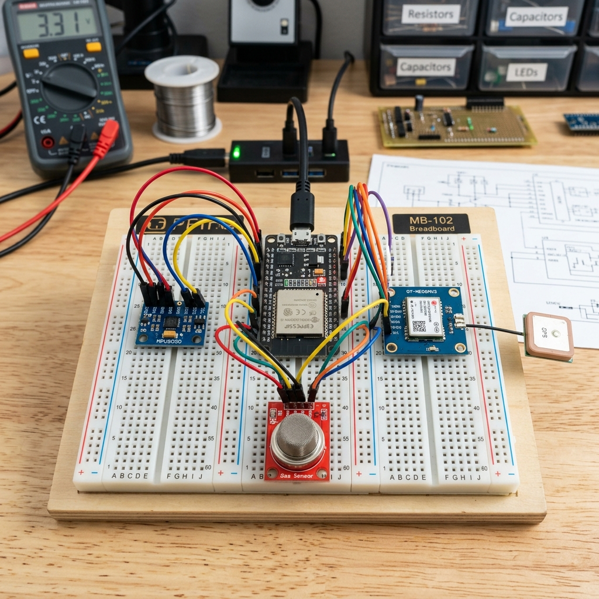
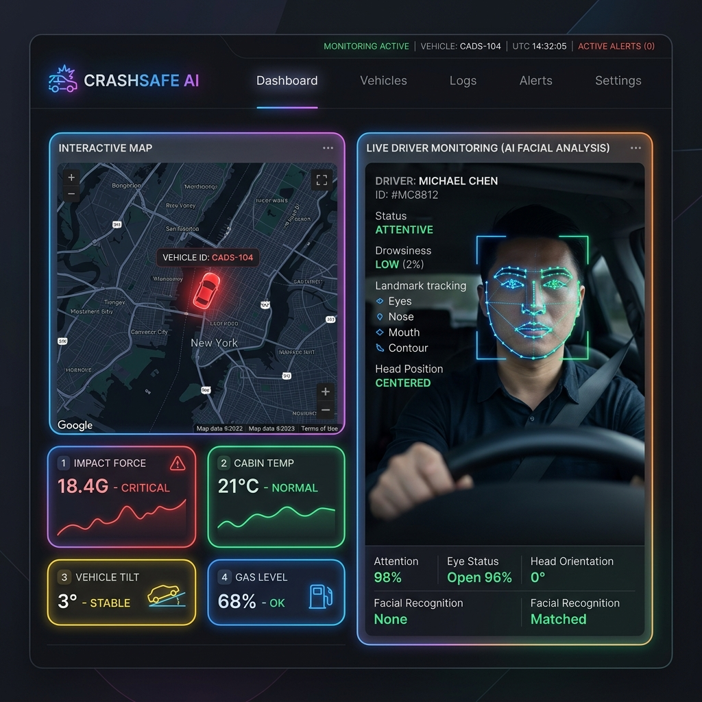

# 🚗 LifeGuardX Pro: Multi-Modal IoT Accident Detection System

> **Status:** Research Prototype | **Target:** IEEE Conference Submission | **Built by:** Merugumala Rabbuni

---

## 📖 Abstract
Vehicular accidents are a leading cause of death worldwide, with delays in emergency response drastically reducing survival rates. This paper presents **LifeGuardX Pro**, a low-cost, cyber-physical system designed to detect accidents in real-time and automate emergency alerts. The system integrates an ESP32-S3 sensor node (MPU6050, GPS, gas, flame, water, DHT11) with dual ESP32-CAM modules for visual evidence capture. A React-based dashboard leverages Google MediaPipe for 478-point facial landmark analysis to assess driver consciousness, combined with a 12-rule fuzzy logic risk engine. Experimental results demonstrate a detection latency of <2 seconds, GPS accuracy of <3 meters, and sub-50ms AI inference, proving that sub-$50 hardware can achieve commercial-grade safety monitoring.

---

## 🔬 Research Summary
**Research Question:**  
Can a sub-$50 ESP32-S3 platform with multi-sensor fusion and in-browser AI detect severe accidents within 2 seconds and automatically alert emergency services?

**Method:**  
- **Sensor Fusion:** MPU6050 (G-force, tilt), NEO-6M GPS, MQ2, Flame, Water, DHT11.  
- **Edge Logic:** Fault-tolerant PATCH updates to Firebase Realtime Database.  
- **AI Perception:** MediaPipe 478-point facial mesh for EAR (Eye Aspect Ratio) and a 12-rule Fuzzy Risk Analyzer.

**Key Results:**  
- ✅ **Detection Latency:** < 2 seconds (measured from impact to cloud alert).  
- ✅ **GPS Accuracy:** < 3 meters (after NMEA-to-decimal calibration).  
- ✅ **AI Inference:** sub-50ms per frame (in-browser).  
- ✅ **Data Integrity:** Dual-camera evidence preserved via PATCH logic (prevents sensor overwrites).

---

## 🏗️ System Architecture
*(For detailed architecture, see [docs/ARCHITECTURE.md](docs/ARCHITECTURE.md))*

 *<!-- Replace with actual image link if you upload one -->*

Briefly:  
`ESP3 (Sensor) -> Firebase RTDB <- React Dashboard (MediaPipe + Maps)`  
`ESPCAM (Image Capture) -> Firebase Storage <- Evidence Viewer`

---

## ⚙️ Hardware & Pinout
*(Full pinout details in [docs/PINOUT.md](docs/PINOUT.md))*

| Component | Microcontroller | Purpose |
| :--- | :--- | :--- |
| MPU6050 | ESP3 | G-force/Tilt/Acceleration Detection |
| NEO-6M GPS | ESP3 | Real-time Location Tracking |
| MQ2, Flame, Water, DHT11 | ESP3 | Environmental Safety Hazards |
| ESP32-CAM (x2) | ESPCAM | Driver State + External Road Evidence |

---

## 🖥️ Dashboard & AI Pipeline
The frontend is built with **React + TypeScript + Tailwind**.  
- **MediaPipe Face Mesh:** Tracks 478 points to compute EAR (Eye Aspect Ratio).  
- **Fuzzy Logic Engine:** Combines EAR with G-force data into a unified risk score.  
- **Map Integration:** Visualizes the vehicle's path and location.

*(Screenshot below)*

---

## 📸 System Demo



🎥 **Live Demo:** [Watch the system in action]([YOUR_YOUTUBE_LINK])

---

## 📂 Repository Structure
```text
Accident-Detection-System/
├── esp3/                  # Main Sensor Firmware (ESP32-S3)
├── espcam/                # Camera Firmware (ESP32-CAM)
├── src/                   # React Dashboard + MediaPipe AI
├── docs/                  # Architecture & Pinout Details
├── img/                   # Screenshots and photos
├── watchdog.cjs           # Heartbeat/Online status monitor
├── firebasewriter.cjs     # Database writer logic
├── DEPENDENCIES.md        # Library requirements
└── README.md              # This file
```

---

## 🚀 How to Run
1. **Firmware:** Open `.ino` files in Arduino IDE. Install dependencies from `DEPENDENCIES.md`.  
2. **Frontend:** `npm install` -> `npm run dev`.  
3. **Config:** Rename `.env.example` to `.env` and add your Firebase credentials.

---

## 🏆 Innovation & Novelty
- **Dual-Camera Evidence:** Simultaneous capture of **driver** (for consciousness) and **road** (for accident cause).  
- **PATCH-based Updates:** Prevents evidence overwriting during sensor noise spikes—a systems-level design not found in similar projects.  
- **Fuzzy + AI Fusion:** Physical sensor thresholds are combined with facial biometrics for a holistic risk assessment.

---

## 📌 Future Work
- [ ] Deploy **TinyML** model (TensorFlow Lite Micro) directly on the ESP32-S3 for offline inference.  
- [ ] Integrate **4G LTE module** for alerts in remote areas without WiFi.  
- [ ] Long-term road testing with statistical logging for false-positive analysis.

---

## 📜 License
MIT © Merugumala Rabbuni
